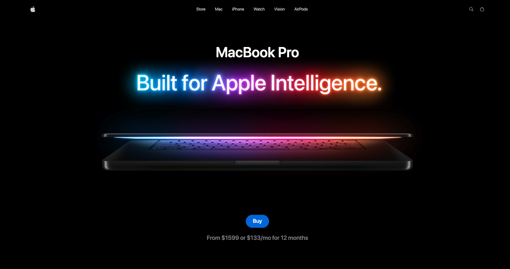

# 💻 MacBook Pro – Interactive 3D Landing Page


Una landing page premium e interactiva para **MacBook Pro**, desarrollada con tecnologías modernas enfocadas en **visualización 3D**, **animaciones avanzadas** y **rendimiento optimizado**.

---

## 🌍 Live Demo

👉 Visita el sitio en vivo: **[https://macbook-pro-m4.netlify.app/ ](https://macbook-pro-m4.netlify.app/ )**


---

## 📸 Preview



---

## 🚀 Descripción

Landing page de alto impacto que showcasea el **MacBook Pro** con:

- Visualización 3D interactiva del producto
- Animaciones fluidas con GSAP
- Transiciones sincronizadas con scroll
- Arquitectura modular y escalable
- Performance optimizado con Vite

---

## ✨ Características Principales

| Feature | Descripción |
|----------|-------------|
| 🎮 3D Viewer | Modelos 3D interactivos con React Three Fiber |
| 🎬 GSAP Animations | ScrollTrigger + SplitText |
| ⚡ Performance | Build optimizado con Vite |
| 🧠 State Management | Zustand para gestión global |
| 📱 Responsive | Mobile-first design |
| 🎨 UI Moderna | Tailwind CSS 4 |

---

## 🛠️ Stack Tecnológico

- **React 19**
- **Vite 7**
- **Tailwind CSS 4**
- **Three.js 0.182**
- **React Three Fiber**
- **React Three Drei**
- **GSAP 3 (ScrollTrigger, SplitText)**
- **Zustand**
- **React Responsive**
- **Clsx**

---

## 📦 Instalación

```bash
# Clonar repositorio
git clone https://github.com/tuusuario/macbook-landing.git

# Entrar al proyecto
cd macbook-landing

# Instalar dependencias
pnpm install

# Ejecutar entorno desarrollo
pnpm dev

# Build producción
pnpm build

# Preview producción
pnpm preview
```

---

## 📂 Estructura del Proyecto

```
src/
├── components/
│   ├── NavBar.jsx
│   ├── Hero.jsx
│   ├── ProductViewer.jsx
│   ├── Showcase.jsx
│   ├── Performance.jsx
│   ├── Feature.jsx
│   ├── Highlights.jsx
│   ├── Footer.jsx
│   ├── models/
│   │   ├── Macbook.jsx
│   │   ├── Macbook-14.jsx
│   │   └── Macbook-16.jsx
│   └── three/
│       ├── ModelSwitcher.jsx
│       └── StudioLights.jsx
├── store/
├── constants/
├── assets/
└── App.jsx
```

---

## 🎬 Interactividad

### 🖥 ProductViewer

- Rotación y zoom del modelo
- Cambio de variantes (14", 16")
- Selector de color
- Iluminación tipo estudio
- Render optimizado

### 🎞 Animaciones

- Split text animations
- ScrollTrigger animations
- Parallax effects
- Transiciones suaves entre secciones
- Microinteracciones UI

---

## 📱 Responsive Design

Optimizado para:

- 📱 Mobile (320px+)
- 📲 Tablet (768px+)
- 💻 Desktop (1024px+)
- 🖥 Large screens (1440px+)

---

## ⚡ Performance

- Code splitting
- Lazy loading
- Optimización de modelos 3D
- Chunk separation con Vite/Rollup
- Assets comprimidos

---

## 🔮 Roadmap

- [ ] Configurador interactivo
- [ ] Comparativa de modelos
- [ ] Vista 360° avanzada
- [ ] Integración e-commerce
- [ ] Reseñas de usuarios
- [ ] Modo oscuro dinámico

---

## 📄 Licencia

Este proyecto está bajo la licencia MIT.

---

## 👨‍💻 Autor

**Alejandro Guzmán Rodríguez**

Frontend Developer | 3D Web Enthusiast | Performance Focused

---

⭐ Si te gustó el proyecto, no olvides darle una estrella.